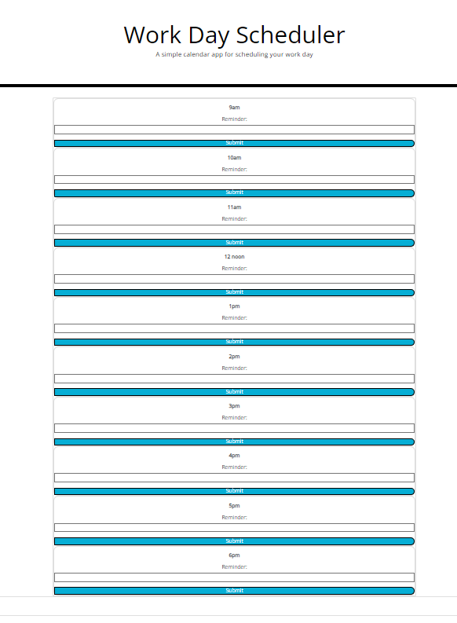

# THIRD PARTY APIs: Work Day Scheduler

##Description

The objective of this assignment was to create a simple calendar application that shows the hours of an average working day on the browser. The website needed to feature dynamically updated HTML and CSS which was powered by jQuery and Moment.js.

##Usage

The user will visit the site and use the page to input reminders into the relevant time boxes. For example, if the user has a dentist appointment at 2:30, they can navigate to the 2pm box and add a reminder that says "dentist at 2:30".  This reminder will then render dynamically in a box at the bottom of the page. 

##Screenshots

##Improvements

I have not yet used Moment.js to change the colours of the time-boxes based on the time the user is accessing the site, this is something I am going to come back to when I have learnt how to do it, and I will resubmit then. 

##Credits

Tutors of the Skills For Life Front End Web Developer Bootcamp for tutoring and guidance.